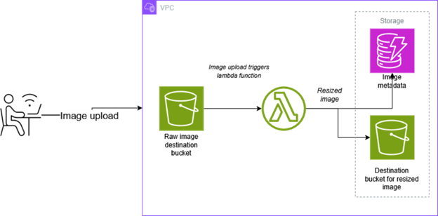
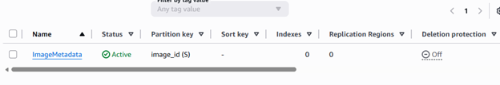
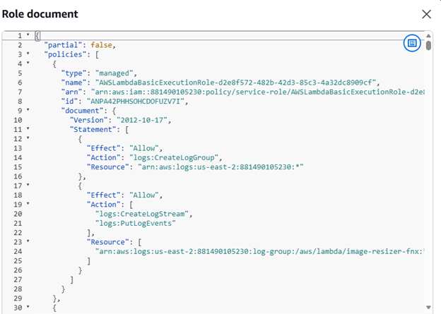
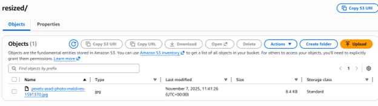
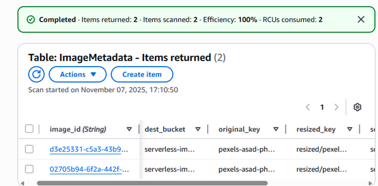

# 🖼️ AWS Lambda Image Resizer with Metadata Storage

This project implements a **serverless image processing pipeline** using **AWS Lambda**, **Amazon S3**, and **DynamoDB**.  
When an image is uploaded to the source S3 bucket, the Lambda function automatically resizes it and stores the output in a destination bucket. Metadata such as file name, size, and format are also recorded in DynamoDB.

---

## 🏗️ Architecture Overview



---

## 🪣 Step 1: Create Source and Destination Buckets

Create two S3 buckets — one for uploading original images and one for storing resized versions.

```bash
aws s3 mb s3://source-bucket-name
aws s3 mb s3://destination-bucket-name


🧠 Step 2: Create DynamoDB Table
aws dynamodb create-table \
  --table-name ImageMetadata \
  --attribute-definitions AttributeName=ImageID,AttributeType=S \
  --key-schema AttributeName=ImageID,KeyType=HASH \
  --billing-mode PAY_PER_REQUEST




---

🧩 Step 3: Lambda Function Code

Below is the Lambda function used to resize the image and store metadata in DynamoDB.

import boto3
import os
import uuid
from PIL import Image
from io import BytesIO

s3 = boto3.client('s3')
dynamodb = boto3.resource('dynamodb')
table = dynamodb.Table('ImageMetadata')

def lambda_handler(event, context):
    source_bucket = event['Records'][0]['s3']['bucket']['name']
    key = event['Records'][0]['s3']['object']['key']
    destination_bucket = os.environ['DEST_BUCKET']
    
    image_obj = s3.get_object(Bucket=source_bucket, Key=key)
    image_data = image_obj['Body'].read()
    image = Image.open(BytesIO(image_data))
    
    image = image.resize((200, 200))
    buffer = BytesIO()
    image.save(buffer, 'PNG')
    buffer.seek(0)
    
    resized_key = f"resized-{key}"
    s3.put_object(Bucket=destination_bucket, Key=resized_key, Body=buffer, ContentType='image/png')
    
    table.put_item(Item={
        'ImageID': str(uuid.uuid4()),
        'OriginalFile': key,
        'ResizedFile': resized_key,
        'Bucket': destination_bucket
    })
    
    return {'status': 'success', 'resized_image': resized_key}


 


🧱 Step 4: Add AWS Precompiled Pillow Layer

To handle image resizing, attach an AWS precompiled Pillow layer compatible with your Lambda runtime (e.g., Python 3.9).
This ensures that your function has the required dependencies without packaging them manually.

By using precompiled layers (e.g., from Klayers), you save time and avoid compatibility issues since these layers are optimized for AWS Lambda runtimes like Python 3.11 / x86_64.

**Example ARN for the layer in us-east-2:** 
arn:aws:lambda:us-east-2:770693421928:layer:Klayers-p311-Pillow:10

You can download a Python 3.11 compatible Pillow layer from:
https://github.com/keithrozario/Klayers
---

⚙️ Step 5: Environment Variables Added

aws lambda update-function-configuration \
  --function-name ImageResizer \
  --environment "Variables={DEST_BUCKET=<destination-bucket-name>}"
---

🔐 Step 6: IAM Permissions

Assign permissions that allow the Lambda function to read and write to S3 and put items in DynamoDB.

The Lambda function requires access to both S3 and DynamoDB.  

Attached the following policies to the Lambda execution role:  

- `AmazonS3FullAccess`  
- `AmazonDynamoDBFullAccess`

Example least-privilege policy:

{
  "Version": "2012-10-17",
  "Statement": [
    {
      "Effect": "Allow",
      "Action": ["s3:GetObject", "s3:PutObject"],
      "Resource": ["arn:aws:s3:::source-bucket-name/*", "arn:aws:s3:::destination-bucket-name/*"]
    },
    {
      "Effect": "Allow",
      "Action": ["dynamodb:PutItem"],
      "Resource": "arn:aws:dynamodb:region:account-id:table/ImageMetadata"
    }
  ]
}

> You can later replace these with custom, least-privilege policies.




---

🧪 Step 7: Test the Pipeline

Upload an image to the source bucket.

Wait for the Lambda function to be triggered automatically.

Check the destination bucket for the resized image.

Verify metadata in the DynamoDB table.

Example Results:

Original Image


Resized Image


View Original Image in Source Bucket


View Resized Image in Destination Bucket


DynamoDB Metadata Entry


---

⚙️ Troubleshooting

Common issues and quick fixes:

Runtime.ImportModuleError: cannot import name '_imaging'
→ Pillow not installed correctly or missing dependencies.
✅ Use a precompiled AWS Pillow layer matching your runtime.

Runtime.OutOfMemory
→ Lambda memory too low.
✅ Increase memory allocation to 512–1024 MB.

Images not appearing in destination bucket
→ Event trigger or IAM issue.
✅ Recheck S3 event notification and Lambda role permissions.

No logs visible
→ Logging not enabled.
✅ Enable CloudWatch Logs in Lambda configuration.
---

💰 Cost Estimation

Approximate cost impacts:

AWS Lambda – Very low (charged by execution time; usually cents per month).

Amazon S3 – Low (storage + request costs).

Amazon DynamoDB – Low (free tier often sufficient for small workloads).

CloudWatch Logs – Minimal (based on log volume).
---

🚀 Project Setup & Deployment Instructions

You can deploy this project using either the AWS Console or the AWS CLI.

Option 1: Deploy via AWS Console

Create S3 buckets and DynamoDB table from the Console.

Go to AWS Lambda → Create function → Author from scratch.

Choose runtime Python 3.9 (or your preferred version).

Paste your function code in the Code editor.

Under Configuration → Environment variables, add:

DEST_BUCKET = <your-destination-bucket-name>

Attach the required IAM role with S3 and DynamoDB permissions.

Add the AWS precompiled Pillow layer ARN.

Configure an S3 event trigger on the source bucket for ObjectCreated events.

Upload an image to the source bucket to test the workflow.

Option 2: Deploy via AWS CLI

Zip your Lambda function:
zip function.zip lambda_function.py

Create the Lambda function:
aws lambda create-function \
  --function-name ImageResizer \
  --runtime python3.9 \
  --role arn:aws:iam::<account-id>:role/<LambdaExecutionRole> \
  --handler lambda_function.lambda_handler \
  --zip-file fileb://function.zip

Add environment variables:
aws lambda update-function-configuration \
  --function-name ImageResizer \
  --environment "Variables={DEST_BUCKET=<destination-bucket-name>}"

Add Pillow layer:
aws lambda update-function-configuration \
  --function-name ImageResizer \
  --layers arn:aws:lambda:us-east-2:770693421928:layer:Klayers-p311-Pillow:10

Create S3 trigger for the Lambda function:
aws s3api put-bucket-notification-configuration \
  --bucket <source-bucket-name> \
  --notification-configuration file://notification.json

🧾 Summary

This serverless pipeline automates image processing and metadata storage without provisioning any servers.
It demonstrates the power of AWS services — combining S3, Lambda, DynamoDB, and CloudWatch to build scalable, event-driven, and cost-efficient solutions.

✅ Author: Ajara Amadu
🏢 Role: Associate Cloud Trainer
📅 Year: 2025

✨ Enhancements

Here are some ideas to improve or extend the project:

Add Multiple Resize Options: Generate various image sizes (thumbnail, medium, large).

Integrate API Gateway: Allow users to trigger resizing via HTTP API instead of S3 upload only.

Add SNS Notifications: Notify users when images are successfully resized.

Enable CloudFront Caching: Speed up access to resized images.

Add Rekognition Integration: Automatically detect and tag image content before saving metadata.

Use AWS Step Functions: Manage complex workflows (resize, store metadata, send notifications).

Add Error Handling & Logging: Store error details in DynamoDB for better monitoring.

Deploy with AWS SAM or CDK: Automate deployment using Infrastructure as Code.


