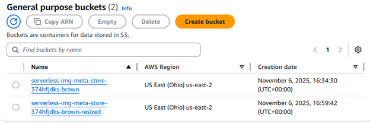

 # AWS Lambda Image Resizer with S3 and DynamoDB

This project demonstrates how to automatically resize images uploaded to an Amazon S3 bucket using AWS Lambda and store the resized images in another S3 bucket.  
The Lambda function also saves image metadata (filename, size, timestamp, etc.) in Amazon DynamoDB.

---

## Architecture Overview

When an image is uploaded to the source S3 bucket, an S3 event trigger invokes the Lambda function, which:

1. Downloads the image from the source bucket.
2. Resizes it using the Pillow library.
3. Uploads the resized version to the destination bucket.
4. Saves image metadata to a DynamoDB table.

---

## Step-by-Step Setup

### Step 1: Source and Destination Buckets Created
Two Amazon S3 buckets were created:

- **Source bucket:** stores original images  
- **Destination bucket:** stores resized images  

> *Tip:* Enable versioning if you want to keep older image versions.

---

### Step 2: DynamoDB Table Created
A DynamoDB table named `ImageMetadata` was created to store:

- Image ID  
- Filename  
- Size  
- Timestamp  

**Primary key:** `image_id` (String)

---

### Step 3: Lambda Function Code Added

The Lambda function responsible for resizing images was added to the AWS Lambda console:

```python
from PIL import Image
import boto3, io

s3 = boto3.client('s3')

def lambda_handler(event, context):
    bucket = event['Records'][0]['s3']['bucket']['name']
    key = event['Records'][0]['s3']['object']['key']
    dest_bucket = bucket + '-resized'

    # Download image
    image_obj = s3.get_object(Bucket=bucket, Key=key)
    image_content = image_obj['Body'].read()

    # Resize image
    img = Image.open(io.BytesIO(image_content))
    img = img.resize((300, 300))

    # Upload resized image
    buffer = io.BytesIO()
    img.save(buffer, 'PNG')
    buffer.seek(0)
    s3.put_object(Bucket=dest_bucket, Key=key, Body=buffer, ContentType='image/png')

    return {'statusCode': 200, 'body': 'Image resized successfully!'}

## Step 4: AWS Precompiled Pillow Layer Added to Lambda Layers

AWS precompiled Pillow layers provide a ready-made version of the Pillow (Python Imaging Library) that you can attach to your Lambda function without having to install or package dependencies yourself. This allows your Lambda to perform image-processing tasks (resizing, cropping, format conversion) without bundling or compiling Pillow manually.

By using precompiled layers (e.g., from Klayers), you save time and avoid compatibility issues since these layers are optimized for AWS Lambda runtimes like Python 3.11 / x86_64.

**Example ARN for the layer in us-east-2:** 
arn:aws:lambda:us-east-2:770693421928:layer:Klayers-p311-Pillow:10


You can download a Python 3.11 compatible Pillow layer from:  
[https://github.com/keithrozario/Klayers](https://github.com/keithrozario/Klayers)

---

## Step 5: Environment Variables Added

In your Lambda configuration → Environment Variables:

- `SOURCE_BUCKET = original-images-bucket`  
- `DEST_BUCKET = resized-images-bucket`  
- `DDB_TABLE = ImageMetadata`  

Click **Save** ✅

---

## Step 6: IAM Permission Policies

The Lambda function requires access to both S3 and DynamoDB.  

Attached the following policies to the Lambda execution role:  

- `AmazonS3FullAccess`  
- `AmazonDynamoDBFullAccess`  

> You can later replace these with custom, least-privilege policies.

---

## Step 7: Test — Upload Image to Source Bucket

Upload an image to the source bucket.  

- Original size: 1.8 MB  
- This upload automatically triggers the Lambda function.

---

## Step 8: Resized Image in Destination Bucket

After processing, the resized image appears in the destination bucket.  

- Resized size: 8.4 KB  
- This confirms successful resizing and storage.

---

## 🧾 Results and Screenshots

### Original Image in the Source Bucket


### Resized Image in the Destination Bucket


### Metadata of the Resized Image in DynamoDB Table


---

## ⚙️ Troubleshooting

| Issue | Possible Cause | Solution |
|-------|----------------|---------|
| `Runtime.ImportModuleError: cannot import name '_imaging'` | Pillow not installed correctly or missing native dependencies | Use AWS precompiled Pillow layer compatible with your region and runtime |
| `Runtime.OutOfMemory` | Function has low memory allocation | Increase Lambda memory to 512 MB–1024 MB |
| Images not appearing in destination bucket | Trigger misconfiguration or IAM permissions | Recheck S3 event notification and Lambda role permissions |
| No logs visible | Logging not enabled | Check CloudWatch Logs under your Lambda’s log group |

---

## 💰 Cost Estimation

| AWS Service | Cost Impact | Notes |
|------------|-------------|-------|
| AWS Lambda | Very low | Charged by duration (typically cents/month for small workloads) |
| Amazon S3 | Low | Storage cost per GB/month; minimal for small images |
| Amazon DynamoDB | Low | Free tier covers up to 25 GB; small metadata writes cost negligible |
| CloudWatch Logs | Minimal | Billed by log volume |

> 💡 Tip: Delete old test images and logs to stay within the free tier.

---

## 🔒 Security Considerations

- Use least privilege IAM roles instead of full access policies.  
- Enable encryption at rest for both S3 buckets and DynamoDB.  
- Use environment variables for sensitive configuration (not hard-coded values).  
- Consider adding input validation to ensure only valid image types are processed.

---

## 🚀 Future Enhancements

- Add API Gateway to expose an endpoint for retrieving stored metadata.  
- Integrate Amazon CloudFront for faster and cached image delivery.  
- Include SNS notifications to alert users when image processing completes.  
- Build a React + AWS Amplify dashboard for real-time image and metadata management.

---

## Tech Stack

- AWS Lambda (Python 3.11)  
- Amazon S3  
- Amazon DynamoDB  
- AWS CloudWatch Logs  
- Pillow (Python Imaging Library)

---

## Conclusion

This project demonstrates an event-driven serverless architecture using AWS Lambda, S3, and DynamoDB to process images automatically. It’s lightweight, cost-efficient, and an excellent starting point for serverless automation.





