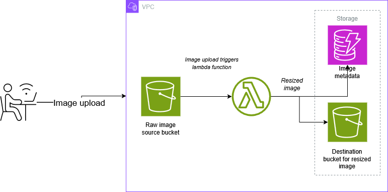
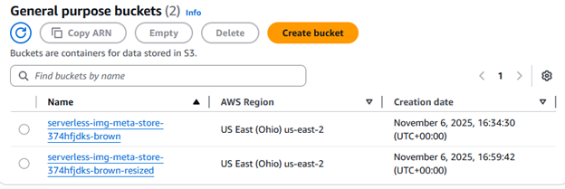
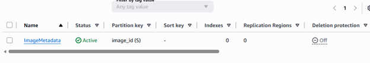
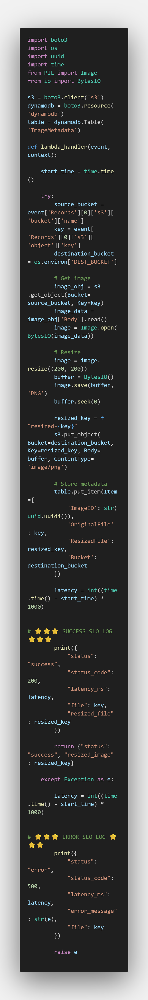
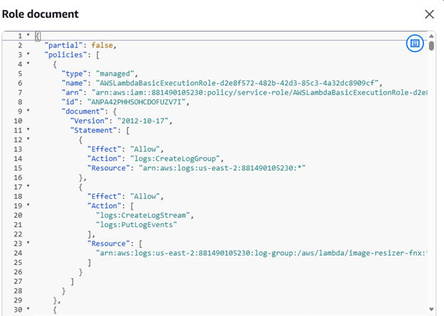
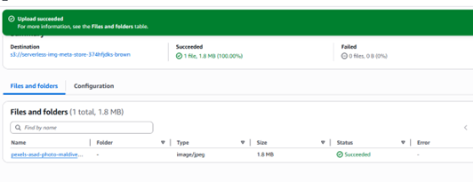
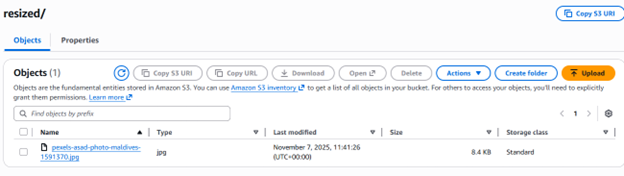
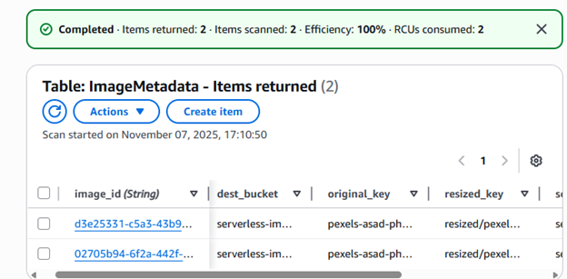

# 🖼️ AWS Lambda Image Resizer with Metadata Storage

## Description:
This project implements a serverless image processing pipeline using AWS Lambda, Amazon S3, and DynamoDB.
When an image is uploaded to the source S3 bucket, the Lambda function automatically resizes it and stores the output in a destination bucket. Metadata such as file name, size, and format are also recorded in DynamoDB.

## 🏗️ Architecture Overview

### 🪣 Step 1: Create Source and Destination Buckets

Create two S3 buckets — one for uploading original images and one for storing resized versions.

### Commands:

aws s3 mb s3://source-bucket-name
aws s3 mb s3://destination-bucket-name

### 🧠 Step 2: Create DynamoDB Table

Create a DynamoDB table named ImageMetadata to store image metadata.

Commands:

aws dynamodb create-table \
  --table-name ImageMetadata \
  --attribute-definitions AttributeName=ImageID,AttributeType=S \
  --key-schema AttributeName=ImageID,KeyType=HASH \
  --billing-mode PAY_PER_REQUEST

### 🧩 Step 3: Lambda Function Code

Below is the Lambda function used to resize images and store metadata in DynamoDB.

Code (Python):

import time
from PIL import Image
from io import BytesIO

s3 = boto3.client('s3')
dynamodb = boto3.resource('dynamodb')
table = dynamodb.Table('ImageMetadata')

def lambda_handler(event, context):

    start_time = time.time()

    try:
        source_bucket = event['Records'][0]['s3']['bucket']['name']
        key = event['Records'][0]['s3']['object']['key']
        destination_bucket = os.environ['DEST_BUCKET']

        # Get image
        image_obj = s3.get_object(Bucket=source_bucket, Key=key)
        image_data = image_obj['Body'].read()
        image = Image.open(BytesIO(image_data))

        # Resize
        image = image.resize((200, 200))
        buffer = BytesIO()
        image.save(buffer, 'PNG')
        buffer.seek(0)

        resized_key = f"resized-{key}"
        s3.put_object(Bucket=destination_bucket, Key=resized_key, Body=buffer, ContentType='image/png')

        # Store metadata
        table.put_item(Item={
            'ImageID': str(uuid.uuid4()),
            'OriginalFile': key,
            'ResizedFile': resized_key,
            'Bucket': destination_bucket
        })

        latency = int((time.time() - start_time) * 1000)

        # ⭐⭐⭐ SUCCESS SLO LOG ⭐⭐⭐
        print({
            "status": "success",
            "status_code": 200,
            "latency_ms": latency,
            "file": key,
            "resized_file": resized_key
        })

        return {"status": "success", "resized_image": resized_key}

    except Exception as e:

        latency = int((time.time() - start_time) * 1000)

        # ⭐⭐⭐ ERROR SLO LOG ⭐⭐⭐
        print({
            "status": "error",
            "status_code": 500,
            "latency_ms": latency,
            "error_message": str(e),
            "file": key
        })

        raise e

### 🧱 Step 4: Add AWS Precompiled Pillow Layer

Attach an AWS precompiled Pillow layer compatible with your Lambda runtime.

Example ARN (Python 3.11, us-east-2):
arn:aws:lambda:us-east-2:770693421928:layer:Klayers-p311-Pillow:10

Download layers: Klayers GitHub

### ⚙️ Step 5: Add Environment Variables

Command:

aws lambda update-function-configuration \
  --function-name ImageResizer \
  --environment "Variables={DEST_BUCKET=<destination-bucket-name>}"

### 🔐 Step 6: IAM Permissions

Attach permissions allowing Lambda to access S3 and DynamoDB.

AmazonS3FullAccess

AmazonDynamoDBFullAccess

Least-privilege IAM policy example:

{
  "Version": "2012-10-17",
  "Statement": [
    {
      "Effect": "Allow",
      "Action": ["s3:GetObject", "s3:PutObject"],
      "Resource": ["arn:aws:s3:::source-bucket-name/*", "arn:aws:s3:::destination-bucket-name/*"]
    },
    {
      "Effect": "Allow",
      "Action": ["dynamodb:PutItem"],
      "Resource": "arn:aws:dynamodb:region:account-id:table/ImageMetadata"
    }
  ]
}

### 🧪 Step 7: Test the Pipeline

Upload an image to the source bucket.

Wait for Lambda to trigger automatically.

Check the destination bucket for the resized image.

Verify metadata in DynamoDB.

### Example Results:

###  Original Image 
  
 
  
###  Resized Image
  
 
  
### DynamoDB Metadata
  

  
### View Original Image
  
 
  
###  View Resized Image
  
 

## ⚙️ Troubleshooting

- **Runtime.ImportModuleError**  
  → Use a precompiled AWS Pillow layer matching your runtime.

- **Runtime.OutOfMemory**  
  → Increase Lambda memory allocation to 512–1024 MB.

- **Images not appearing in destination bucket**  
  → Recheck S3 event notifications and Lambda IAM role permissions.

- **No logs visible**  
  → Enable CloudWatch Logs in Lambda configuration.

## 💰 Cost Estimation

AWS Lambda – Very low (charged by execution time)

Amazon S3 – Low (storage + requests)

Amazon DynamoDB – Low (free tier sufficient)

CloudWatch Logs – Minimal

## 🚀 Project Setup & Deployment Instructions

#### Option 1: AWS Console

Create S3 buckets and DynamoDB table

Create Lambda function, add code

Add environment variable DEST_BUCKET=<destination-bucket-name>

Attach IAM role

Add Pillow layer

Configure S3 event trigger

Test by uploading an image

#### Option 2: AWS CLI

zip function.zip lambda_function.py

aws lambda create-function \
  --function-name ImageResizer \
  --runtime python3.9 \
  --role arn:aws:iam::<account-id>:role/<LambdaExecutionRole> \
  --handler lambda_function.lambda_handler \
  --zip-file fileb://function.zip

aws lambda update-function-configuration \
  --function-name ImageResizer \
  --environment "Variables={DEST_BUCKET=<destination-bucket-name>}"

aws lambda update-function-configuration \
  --function-name ImageResizer \
  --layers arn:aws:lambda:us-east-2:770693421928:layer:Klayers-p311-Pillow:10

aws s3api put-bucket-notification-configuration \
  --bucket <source-bucket-name> \
  --notification-configuration file://notification.json

## 🧾 Summary

This serverless pipeline automates image processing and metadata storage without provisioning servers.
It combines S3, Lambda, DynamoDB, and CloudWatch for scalable, event-driven, and cost-efficient solutions.

## ✅ Author

### Ajara Amadu
### Role: Associate Cloud Trainer
### Year: 2025

## ✨ Enhancements

- Generate multiple image sizes

- Integrate API Gateway to trigger resizing via HTTP

- Add SNS notifications

- Enable CloudFront caching

- Add Rekognition integration

- Use AWS Step Functions

- Add error handling & logging

- Deploy using AWS SAM or CDK